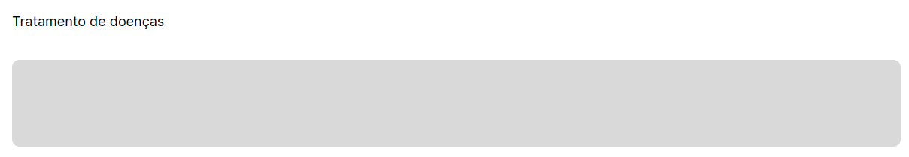

# 🏳️‍🌈 Lacrei Front-End Prototype

---

## 📌 The Challenge

The idea is to develop a registration and profile page that includes login, registration, and a professional profile for Lacrei, aiming to automate the current process and provide a better experience for professionals, encouraging them to register and become partners.

### 🔧 Installation

To **deploy** this application, you need to clone the repository:

git clone https://github.com/michaelmartinlee/front-lacrei

Then, install the packages and dependencies:

npm install

### 📋 Features

Our application is intended to be a fully customizable prototype, so we implement best practices in folder architecture:
#

  

* The "assets" folder: Stores all image files

* The "components" folder: Stores all components that are used at least twice in the application

* The "Pages" folder: Contains the entire structure of the pages

* The "Styles" folder: Contains global styles like font, margin, etc.

* In the `Routes.tsx` file, all application routes are defined            

#
---
##### In /components, we have the main and most used components such as:

#

* **Button Component**:

* **ButtonBackProgress Component**:

#

* **Header and Footer Components**:

#

* **InputRadioCareer Component**:

#
* **LabelInput Component**:

#

* **LabelTextArea Component**:
#

#
* **StatesSelect Component**:

---

### 🔧 Tools Used

The following tools were used:

* [Typescript](https://www.typescriptlang.org/) - Programming Language
* [Vite](https://vitejs.dev/) - React Framework
* [Styled Components](https://https://styled-components.com/) - Styling Framework

#
---

## ✒️ Authors
#

* [Michael Martin Lee](https://github.com/michaelmartinlee/)
* [Marcelo Barbosa](https://github.com/Marceloabf)
* [Beatriz Gebhardt](https://github.com/Beatrizgebhardt)

#
---

## 🎁 Expressions of Gratitude
#
We are deeply grateful to have participated in a social project with such a noble intention. The love in our hearts deserves to be shared to welcome and help as many people as we can ❤️​.
